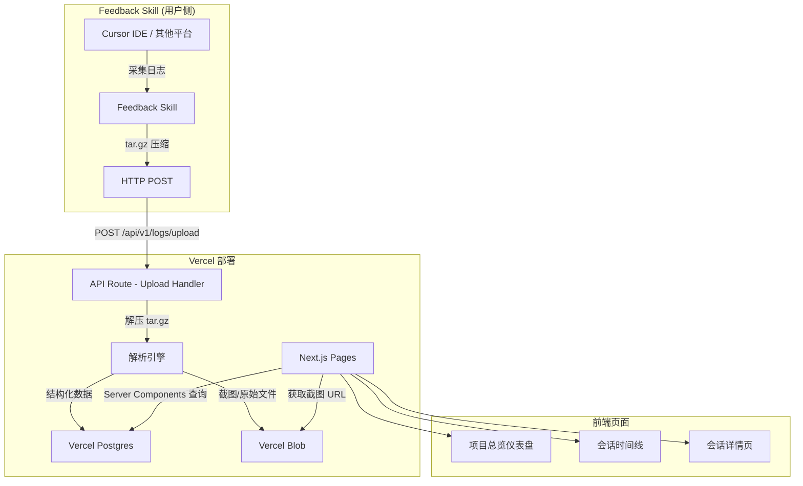
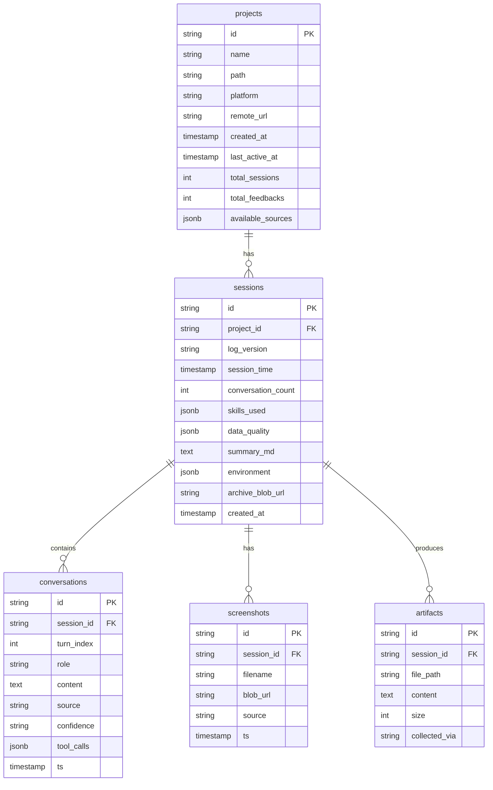
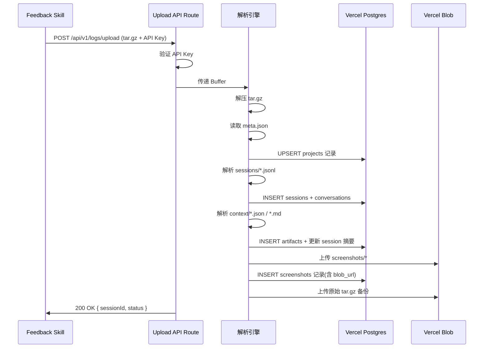

## Product Overview

一个部署在 Vercel 上的反馈日志中心网站（ODN Feedback Center），用于接收、存储和可视化展示来自其他平台（如 Cursor IDE）上 Feedback Skill 采集的上下文日志数据。Skill 在用户侧采集对话历史、截图、代码变更、环境快照等数据后，通过 HTTP POST 将 tar.gz 压缩包上传到本网站的 API 接口，网站负责解析、存储并以可视化面板展示这些反馈数据。

## Core Features

1. **日志上传 API**：提供 `POST /api/v1/logs/upload` 接口，接收 Feedback Skill 回传的 tar.gz 压缩包，解析其中的 sessions（.jsonl 对话日志）、screenshots（截图）、context（环境快照 / 产出文件 / 上下文摘要）和 meta.json，存储到持久化存储中

2. **项目总览仪表盘**：首页展示所有接入项目的概览卡片，包括项目名称、最近活跃时间、总会话数、总反馈数、平台信息、数据来源类型等关键指标

3. **会话时间线**：进入某个项目后，按时间线展示该项目的所有会话记录，每个会话显示时间、对话轮数、涉及的 Skill、数据质量状态等摘要信息

4. **会话详情页**：展示单个会话的完整内容，包括：

- 对话历史（按时间线展示 user/AI 交互，标注数据来源和置信度）
- 上下文摘要（需求概述、执行时间线、产出文件列表）
- 截图画廊（浏览器截图、设计稿等）
- 环境信息（项目环境、Git 状态、系统信息）
- 数据质量报告（各维度采集路径的状态和覆盖率）

5. **搜索与筛选**：支持按项目名、时间范围、数据来源类型、Skill 名称进行筛选和搜索

## Tech Stack

- **框架**: Next.js 14 (App Router) + TypeScript
- **样式**: Tailwind CSS
- **UI 组件**: shadcn/ui
- **存储**: Vercel Blob（文件存储，用于截图和原始压缩包）+ Vercel Postgres（结构化数据，用于 meta、sessions、对话记录索引）
- **文件解析**: tar（Node.js tar 库解析 tar.gz）
- **部署**: Vercel（Serverless Functions）
- **包管理器**: pnpm

## Implementation Approach

采用 Next.js App Router 架构，利用 Vercel 原生生态（Postgres + Blob）实现全栈 Serverless 方案。

**核心策略**：

- API Route 接收 tar.gz 上传 → 在 Serverless Function 中解压 → 将结构化数据（meta、对话日志、摘要）写入 Postgres → 将二进制文件（截图、原始压缩包）写入 Blob
- 前端使用 Server Components 直接查询 Postgres 渲染页面，减少客户端 JavaScript 体积
- 对话详情等交互密集页面使用 Client Components + SWR 做数据获取

**关键技术决策**：

1. **存储方案选择 Vercel Postgres + Blob 而非纯 Blob**：纯 Blob 无法高效查询和筛选，Postgres 提供结构化索引能力，Blob 存储二进制大文件。两者配合覆盖所有需求。

2. **tar.gz 在 Serverless 中解析**：Vercel Serverless Function 有 4.5MB body limit（Pro 计划 50MB）。对于大多数反馈日志（文本为主），免费版足够。若超限，可改为先上传 Blob 再异步解析。

3. **API 鉴权**：使用简单的 API Key 机制（环境变量配置），Skill 端在 header 中携带 `Authorization: Bearer <key>`，避免未授权上传。

## Implementation Notes

- **Vercel Serverless body 大小限制**：默认 4.5MB，需在 `next.config.js` 中配置 `api.bodyParser.sizeLimit` 为合理值。若日志包含大量截图导致超限，后续可拆分为"先上传 Blob 获取 URL → 再提交 meta"的两步流程
- **tar.gz 解析安全性**：使用 `tar` 库时需限制解压文件数量和大小，防止 zip bomb 攻击。设置最大文件数 100、单文件最大 10MB、总大小最大 50MB
- **Postgres 连接池**：Vercel Postgres 在 Serverless 环境下使用 `@vercel/postgres` SDK，内置连接池管理，无需额外配置
- **JSONL 解析容错**：对话日志为逐行 JSON，需逐行 try-catch 解析，跳过格式错误的行并记录警告
- **截图存储路径**：Blob 中按 `{projectName}/{sessionId}/screenshots/{filename}` 组织，便于按项目和会话查询

## Architecture Design



### 数据模型



### 请求处理流程



## Directory Structure

本项目从零搭建，完整目录结构如下：

```
feedback-website/
├── package.json                          # [NEW] 项目配置，dependencies: next, react, tailwindcss, @vercel/postgres, @vercel/blob, tar, shadcn 相关
├── next.config.ts                        # [NEW] Next.js 配置，设置 API body size limit、图片域名白名单（Blob 域名）
├── tsconfig.json                         # [NEW] TypeScript 配置，严格模式
├── tailwind.config.ts                    # [NEW] Tailwind 配置，扩展 shadcn 主题
├── postcss.config.mjs                    # [NEW] PostCSS 配置
├── .env.local.example                    # [NEW] 环境变量模板：POSTGRES_URL, BLOB_READ_WRITE_TOKEN, API_SECRET_KEY
├── .gitignore                            # [NEW] Git 忽略规则
├── components.json                       # [NEW] shadcn/ui 配置
├── src/
│   ├── app/
│   │   ├── layout.tsx                    # [NEW] 根布局，全局导航栏（Logo + "ODN Feedback Center" 标题 + 暗色模式切换），全局字体和 Tailwind 样式引入
│   │   ├── globals.css                   # [NEW] 全局样式，Tailwind directives + shadcn CSS 变量 + 自定义动画
│   │   ├── page.tsx                      # [NEW] 首页/项目总览仪表盘。Server Component 查询 Postgres 获取所有项目列表，渲染项目卡片网格。每张卡片展示项目名、平台、最近活跃时间、会话数、数据来源标签。支持搜索框按项目名筛选
│   │   ├── projects/
│   │   │   └── [projectId]/
│   │   │       ├── page.tsx              # [NEW] 项目详情/会话时间线页。展示项目基本信息头部 + 按时间倒序排列的会话卡片列表。每个会话卡片显示时间、对话轮数、涉及 Skill 标签、数据质量状态指示器。支持按时间范围和来源类型筛选
│   │   │       └── sessions/
│   │   │           └── [sessionId]/
│   │   │               └── page.tsx      # [NEW] 会话详情页（Client Component）。Tab 式布局展示：(1) 对话历史 Tab - 聊天气泡样式的 user/AI 交互，每条消息标注 source 和 confidence 徽章 (2) 摘要 Tab - 渲染 summary markdown（需求概述、执行时间线表格、产出文件列表）(3) 截图 Tab - 图片画廊，点击放大 (4) 环境 Tab - 结构化展示项目环境、Git、系统信息 (5) 质量报告 Tab - 数据质量表格，各维度采集状态
│   │   └── api/
│   │       └── v1/
│   │           └── logs/
│   │               └── upload/
│   │                   └── route.ts      # [NEW] 核心上传 API。验证 Authorization header 中的 API Key → 读取请求体为 Buffer → 调用解析引擎处理 tar.gz → 返回 { success, sessionId, projectName }。错误处理：401 未授权、413 体积超限、422 解析失败、500 服务器错误
│   ├── lib/
│   │   ├── db/
│   │   │   ├── schema.ts                # [NEW] 数据库表定义。使用 @vercel/postgres 的 sql 模板标签。定义 projects、sessions、conversations、screenshots、artifacts 五张表的建表 SQL 和 TypeScript 类型
│   │   │   ├── migrate.ts               # [NEW] 数据库迁移脚本。读取 schema 定义执行建表，支持幂等运行（CREATE TABLE IF NOT EXISTS）。可通过 `npx tsx src/lib/db/migrate.ts` 手动执行
│   │   │   └── queries.ts               # [NEW] 数据库查询函数集合。封装所有 CRUD 操作：getProjects / getProjectById / getSessions / getSessionDetail / upsertProject / insertSession / insertConversations（批量）/ insertScreenshot / insertArtifact。使用参数化查询防 SQL 注入
│   │   ├── parser/
│   │   │   ├── archive-parser.ts         # [NEW] tar.gz 解析引擎核心。接收 Buffer → 使用 tar 库解压到内存 → 按文件路径分类（meta.json / sessions/*.jsonl / context/*.json / context/*.md / context/*.jsonl / screenshots/*）→ 返回结构化的 ParsedArchive 对象。包含大小和数量限制的安全检查
│   │   │   ├── jsonl-parser.ts           # [NEW] JSONL 文件解析器。逐行解析 .jsonl 文件，每行 try-catch 容错，跳过格式错误行并收集警告。提取 type=user-input 和 type=ai-output 的对话记录，保留 source 和 confidence 字段
│   │   │   └── summary-parser.ts         # [NEW] Markdown 摘要解析器。解析 summary-{timestamp}.md 中的结构化内容：需求概述、执行时间线表格、涉及 Skill、产出文件、环境信息、数据质量报告。返回结构化 JSON 供前端渲染
│   │   ├── upload/
│   │   │   └── process-upload.ts         # [NEW] 上传处理编排器。协调完整的上传流程：解析 tar.gz → upsert 项目 → 插入会话和对话记录 → 上传截图到 Blob → 插入产出文件 → 备份原始压缩包到 Blob。使用数据库事务保证数据一致性
│   │   ├── auth.ts                       # [NEW] API 鉴权工具。验证请求 header 中的 Bearer token 与环境变量 API_SECRET_KEY 匹配。导出 validateApiKey(request) 函数
│   │   └── utils.ts                      # [NEW] 通用工具函数。生成唯一 ID（nanoid）、时间格式化、文件大小格式化、安全的 JSON 解析等
│   ├── components/
│   │   ├── ui/                           # [NEW] shadcn/ui 基础组件目录（通过 npx shadcn-ui@latest add 安装）：button, card, badge, tabs, input, dialog, table, skeleton, scroll-area
│   │   ├── project-card.tsx              # [NEW] 项目卡片组件。展示项目名称（大字标题）、平台图标、最近活跃时间（相对时间）、会话数/反馈数统计、数据来源类型标签组（如 realtime/specstory 等彩色 badge）。卡片整体可点击跳转到项目详情
│   │   ├── session-card.tsx              # [NEW] 会话卡片组件。展示会话时间、对话轮数、涉及 Skill 列表（badge 标签）、数据质量状态指示器（绿/黄/红圆点）、摘要首行预览文字。可点击跳转会话详情
│   │   ├── conversation-list.tsx         # [NEW] 对话历史列表组件。聊天气泡样式渲染 user（右侧蓝色）和 AI（左侧灰色）消息。每条消息底部显示 source 标签（如 "realtime" 绿色、"agent-recall" 黄色）和 confidence 指示器。支持代码块语法高亮
│   │   ├── screenshot-gallery.tsx        # [NEW] 截图画廊组件。网格布局展示缩略图，点击打开 Dialog 全屏预览。显示截图文件名和来源标注
│   │   ├── quality-report.tsx            # [NEW] 数据质量报告组件。表格形式展示各数据维度（对话历史/截图/代码变更/产出文件/环境快照）的采集路径、状态（成功/跳过/失败图标）和覆盖率
│   │   ├── environment-info.tsx          # [NEW] 环境信息展示组件。分组展示 project、git、system、workspace 四个维度的信息，使用 key-value 对列表样式
│   │   ├── summary-viewer.tsx            # [NEW] 摘要查看组件。渲染 Markdown 摘要内容，包括需求概述段落、执行时间线表格、产出文件列表。使用 react-markdown 或简单 HTML 渲染
│   │   ├── search-filter.tsx             # [NEW] 搜索筛选栏组件。搜索输入框 + 时间范围选择 + 数据来源多选下拉。使用 URL search params 管理筛选状态，支持 Server Component 读取
│   │   └── nav-header.tsx                # [NEW] 顶部导航栏组件。Logo + 站点标题 + 面包屑导航 + 暗色模式切换按钮
│   └── types/
│       └── index.ts                      # [NEW] 全局 TypeScript 类型定义。Project / Session / Conversation / Screenshot / Artifact / ParsedArchive / UploadResponse / DataQualityReport 等核心接口定义，与数据库 schema 和 API 契约对齐
└── scripts/
    └── seed.ts                           # [NEW] 开发用种子数据脚本。生成模拟的项目、会话、对话数据插入 Postgres，方便本地开发和 UI 调试
```

## Key Code Structures

```typescript
// src/types/index.ts - 核心类型定义

export interface Project {
  id: string;
  name: string;
  path: string;
  platform: string;
  remoteUrl: string | null;
  createdAt: string;
  lastActiveAt: string;
  totalSessions: number;
  totalFeedbacks: number;
  availableSources: string[];
}

export interface Session {
  id: string;
  projectId: string;
  logVersion: string;
  sessionTime: string;
  conversationCount: number;
  skillsUsed: string[];
  dataQuality: DataQualityReport;
  summaryMd: string | null;
  environment: EnvironmentSnapshot | null;
  archiveBlobUrl: string | null;
  createdAt: string;
}

export interface Conversation {
  id: string;
  sessionId: string;
  turnIndex: number;
  role: 'user' | 'assistant';
  content: string;
  source: 'realtime' | 'specstory' | 'cursor-db' | 'agent-recall';
  confidence: 'high' | 'medium' | 'low';
  toolCalls: Record<string, unknown>[] | null;
  ts: string;
}

export interface ParsedArchive {
  meta: ProjectMeta;
  sessions: ParsedSession[];
  screenshots: { filename: string; buffer: Buffer }[];
  context: {
    environment: EnvironmentSnapshot | null;
    artifacts: Artifact[];
    summary: string | null;
  };
}
```

## Design Style

参照 **One Design Next** 的设计风格——简洁、清爽、专业的**浅色系**设计语言。

**核心设计特征**：

- **纯白/浅灰背景**（#FFFFFF / #FAFAFA），干净整洁，高留白
- **黑色主文字**（#1A1A1A），层次分明的灰色辅助文字（#666 / #999）
- **卡片式布局**，带细微边框（#E5E5E5）和小圆角（8px），无阴影或极轻阴影
- **简洁的线性图标**，搭配中英文双语标签
- **顶部简洁导航栏**：白色背景，左侧黑色圆形 Logo + 站名，右侧品牌标识，底部 1px 分割线
- **分类分组展示**：内容按类型分组，每组有小图标 + 中文标题
- **无多余装饰**，信息密度适中，可读性极高
- **交互**：卡片 hover 时边框变深或浅灰背景高亮，过渡平滑（150ms）
- **字体**：系统字体栈（-apple-system, "PingFang SC", "Helvetica Neue", sans-serif）

**色彩体系**：

- 主色：#1A1A1A（黑色，用于标题和主要操作）
- 背景：#FFFFFF（主区域）/ #FAFAFA（页面底色）/ #F5F5F5（卡片悬停）
- 边框：#E5E5E5（默认）/ #D4D4D4（悬停）
- 文字：#1A1A1A（主标题）/ #525252（正文）/ #A3A3A3（辅助说明）
- 功能色：#22C55E（成功/高质量）/ #EAB308（警告/中等）/ #EF4444（错误/低质量）/ #3B82F6（链接/信息）
- 标签色：柔和的彩色 badge，如 realtime=#DBEAFE specstory=#FEF3C7 cursor-db=#E0E7FF agent-recall=#FCE7F3

## Page Planning

### Page 1: 项目总览仪表盘（首页）

- **顶部导航栏**：白色背景，左侧黑色圆形 Logo + "ODN Feedback Center" 黑色粗体标题，右侧品牌标识。底部 1px #E5E5E5 分割线
- **页面标题区**：左对齐大标题 "ODN Feedback Center" + 一行灰色说明文字。下方横向排列 Tab 式分类标签（如"全部项目"、"最近活跃"、"最多反馈"），带图标前缀，选中态为黑色边框按钮
- **统计概览区**：横向排列 3-4 个简洁统计数字，无卡片包裹，纯文字+数字，如"12 个项目 · 48 个会话 · 156 次反馈"
- **项目卡片网格**：按分类分组展示（如"最近活跃"、"所有项目"），每组有小图标 + 分类标题。卡片为白色背景 + 细边框 + 小圆角，内部居中排列：项目图标 + 项目名（黑色粗体）+ 平台说明（灰色小字）。响应式网格（大屏 4 列、中屏 3 列、小屏 2 列）。hover 时背景变 #F5F5F5

### Page 2: 项目详情 / 会话时间线

- **项目信息头部**：面包屑导航（灰色小字链接）+ 项目名大标题 + 项目元信息行（平台、Git remote、创建时间），纯文字排列，无装饰背景
- **筛选工具栏**：简洁行内布局，白色背景带细边框的筛选控件。时间范围 + 数据来源多选 + Skill 筛选
- **会话列表**：简洁列表样式（非时间轴），每行为一个会话条目，左侧时间、中间摘要和 Skill 标签、右侧对话轮数和质量状态圆点。行间 1px 分割线。hover 行背景高亮
- **分页**：底部简洁分页器，页码 + 上下翻页箭头

### Page 3: 会话详情页

- **会话头部**：返回箭头 + 会话时间标题 + 对话轮数 + 质量状态徽章。简洁单行排列
- **Tab 导航栏**：5 个 Tab（对话历史 / 摘要 / 截图 / 环境 / 质量报告），使用下划线指示器，黑色选中态，灰色未选中态
- **对话历史 Tab**：简洁列表样式——每条消息为一个区块，user 和 AI 用不同的浅色背景区分（user: 白色，AI: #F9FAFB）。每条消息顶部标注角色（黑色小标签），底部灰色小字标注 source 和 confidence。代码块使用浅色背景语法高亮
- **摘要 Tab**：Markdown 渲染，使用 One Design Next 风格的排版——清晰的标题层级、简洁的表格样式（细边框）、有序的列表
- **截图 Tab**：网格缩略图，白色边框 + 细圆角，点击弹出简洁的全屏预览 Dialog
- **环境 Tab**：分组展示（Project / Git / System / Workspace），每组为带细边框的卡片，内部 key-value 对列表
- **质量报告 Tab**：简洁数据表格，细边框，状态列使用功能色圆点（绿/黄/红）

## Agent Extensions

### Skill

- **design-consultation**
- Purpose: 为项目创建完整的设计系统，生成 DESIGN.md 作为设计规范源，确保 UI 开发过程中风格一致性
- Expected outcome: 产出 DESIGN.md 文件，包含色彩体系、字体规范、间距系统、组件样式指南

### SubAgent

- **code-explorer**
- Purpose: 在实现过程中探索 shadcn/ui 组件结构和 Next.js App Router 最佳实践，确保代码架构合理
- Expected outcome: 快速定位依赖库的用法模式，辅助高质量代码编写