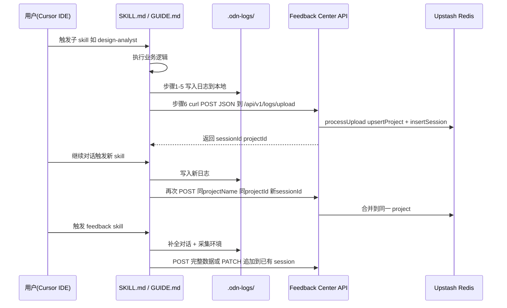

## 用户需求

用户要修改两个项目中的文件，使 Skill 端和网站端配合实现完整的自动回传 + 增删改查功能。

## 产品概述

当前有两个项目协作工作：

- **Skill 项目**（位于 `/Users/iveszheng/Desktop/OD副本/one-design-next/.cursor/skills/`）：AI 在用户项目中执行子 skill 后，将对话日志写入本地 `.odn-logs/` 目录
- **Feedback 网站**（位于 `/Users/iveszheng/Desktop/Feeback website/`）：接收、存储、展示 Skill 回传的日志数据，部署在 `https://odn-feedback-center.vercel.app/`

用户需要实现：每次子 skill 执行完写入日志后，自动将数据 POST 到线上 API；多次交互属于同一个项目时应合并到一个 project 下；网站侧需要支持对回传数据的增删改查。

## 核心功能

1. **SKILL.md 自动回传**：在子 skill 执行完日志写入后，自动构造 JSON 并 POST 到线上 API，使用硬编码的 API 密钥 `odn-feedback-2026-secret`
2. **Feedback GUIDE.md 增量回传**：优化回传逻辑，支持对已有 session 追加对话数据，而非每次都创建新 session
3. **项目识别机制**：通过 `projectName` 的 slug 化结果作为 `projectId`，同名项目自动合并到同一 project 下
4. **网站 CRUD API**：补全 Update（追加对话/截图到已有 session）和 Delete（删除项目、会话）的 API 路由
5. **前端管理操作**：在项目列表和会话列表页添加删除按钮，在会话详情页支持数据刷新

## 技术栈

- **网站项目**：Next.js 15 + TypeScript + Tailwind CSS + shadcn/ui + Upstash Redis（@upstash/redis）
- **Skill 项目**：纯 Markdown 指令文件（SKILL.md / GUIDE.md），通过 curl 调用 API

## 实现方案

### 整体策略

分两条线并行修改：

**Skill 侧**（Markdown 指令修改）：

- 在 `SKILL.md` 的「日志写入执行指令」最后增加「步骤 6：自动回传」，将刚写入的 `.odn-logs/` 数据组装为 JSON 并 curl POST 到线上 API
- 在 `GUIDE.md` 中优化回传逻辑，增加增量模式支持（追加到已有 session）

**网站侧**（代码修改）：

- 在 `store.ts` 补充 `deleteProject`、`deleteSession`、`updateSession`、`appendConversations` 等存储函数
- 新增 `PATCH /api/v1/sessions/[sessionId]` 用于追加数据到已有 session
- 在 `projects/[projectId]/route.ts` 和 `sessions/[sessionId]/route.ts` 导出 `DELETE` 方法
- 前端页面添加删除按钮和确认交互

### 关键技术决策

1. **项目识别用 slug**：`projectId = slugify(meta.projectName)`，这意味着同一个项目名的多次上传自动合并。已有代码 `process-upload.ts` 中的 `upsertProject` 已经实现了这个逻辑，无需修改
2. **增量追加用 PATCH**：新增 `PATCH /api/v1/sessions/[sessionId]` 接口，将新的 conversations 追加到已有数组末尾，而非覆盖。这样 SKILL.md 每次子 skill 执行完可以只发送本次新增的对话
3. **删除用级联清理**：删除 project 时级联删除其下所有 sessions 及关联数据；删除 session 时清理 conversations、screenshots、artifacts 的 KV keys
4. **API 密钥硬编码在 Skill 指令中**：用户已确认密钥为 `odn-feedback-2026-secret`，直接写入 Skill 指令的 curl 命令中。Skill 是 Markdown 指令文件，不存在编译打包风险

## 实现注意事项

- **向后兼容**：现有 `POST /api/v1/logs/upload` 接口不变，仍然每次创建新 session。新增的 `PATCH` 是增量路由，两种方式共存
- **KV 存储操作原子性**：Upstash Redis 的 `set` 是覆盖式的，追加 conversations 时需要先 `get` 再 `set`，不存在并发冲突风险（Vercel Serverless 单实例处理）
- **删除的级联一致性**：删除 project 时先获取其所有 session IDs，逐个清理子数据，最后清理 project 本身。使用 pipeline 批量操作减少网络往返
- **前端删除需要鉴权**：DELETE API 使用与上传相同的 Bearer Token 鉴权，前端删除按钮弹出确认框后调用 API（密钥可暂时硬编码在前端，后续可改为管理员登录）

## 架构设计



## 目录结构

### Skill 项目（修改 2 个文件）

```
/Users/iveszheng/Desktop/OD副本/one-design-next/.cursor/skills/
├── SKILL.md                          # [MODIFY] 在日志写入执行指令末尾新增步骤6自动回传至 ODN Feedback Center
│                                     # 在步骤5 session-end 写入之后构造 FeedbackPayload JSON 通过 curl POST 到线上 API
│                                     # 同时将日志回传预留章节替换为实际回传指令写入 API 地址和密钥
│
└── p5-feedback/
    └── GUIDE.md                      # [MODIFY] 优化第5步回传逻辑：
                                      # (1) 将 API 密钥从读取配置文件改为硬编码密钥
                                      # (2) 增加增量追加模式说明 PATCH 已有 session
                                      # (3) 回传失败的错误处理更明确
```

### Feedback 网站项目（修改 7 个文件）

```
/Users/iveszheng/Desktop/Feeback website/
├── src/
│   ├── lib/db/store.ts               # [MODIFY] 新增6个存储函数：deleteProject deleteSession updateSession
│   │                                 #   appendConversations appendScreenshots appendArtifacts
│   ├── types/index.ts                # [MODIFY] 新增 PatchSessionPayload 类型定义
│   ├── app/
│   │   ├── api/v1/projects/[projectId]/route.ts  # [MODIFY] 新增 DELETE 方法
│   │   ├── api/v1/sessions/[sessionId]/route.ts  # [MODIFY] 新增 DELETE 和 PATCH 方法
│   │   ├── page.tsx                              # [MODIFY] 添加项目删除逻辑
│   │   └── projects/[projectId]/page.tsx         # [MODIFY] 添加会话删除逻辑
│   └── components/
│       ├── project-card.tsx          # [MODIFY] 添加删除按钮
│       └── session-card.tsx          # [MODIFY] 添加删除按钮
```

## Agent Extensions

### SubAgent

- **code-explorer**
- 用途：在实施过程中探索 Skill 项目和 Feedback 网站项目的文件依赖关系，确认修改不会遗漏关联文件
- 预期结果：准确定位所有需要修改的文件路径和代码位置